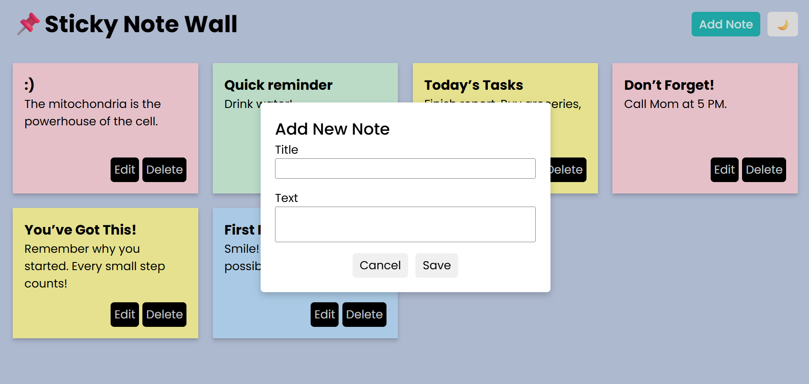

<h1>📌 Sticky Note Wall</h1>

A simple note-taking web app built as a learning project based on a YouTube tutorial.

Quick Notes lets you:

- Add, edit, and delete notes.

- Save notes locally in your browser using localStorage.

- Toggle dark/light theme with your preference saved.

- Enjoy colorful notes for easy organization.
